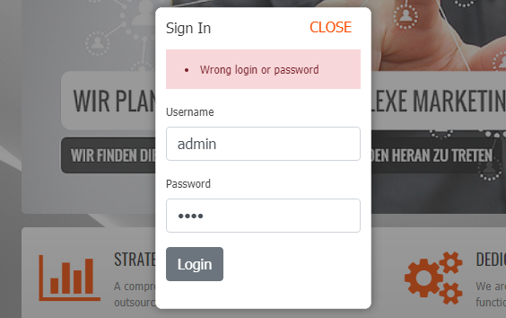
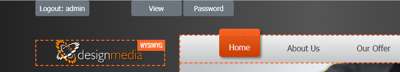
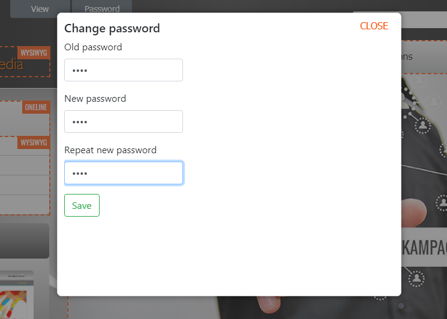
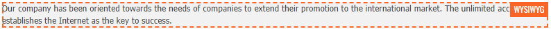

# Simple frontend CMS
#### Object PHP, MySQL, jQuery, Bootstrap, TinyMCE, MVC

Frontend CMS based on <a href="https://github.com/tomasz-dabrowski/frontend-sample" target="_blank">
Frontend sample project</a>

In the upper left corner there's a "Login" button:

After clicking it, you can enter your username and password (validation using the jQuery library):

After logging in, buttons for quick change preview and password change appear at the top of the page:

You can change the password (encryption with the md5 algorithm)

Also you can see sections (surrounded by an orange frame) that can be edited by the CMS system:

There are two ways to edit:

1. Using the TinyMCE editor - in the upper right corner of the orange frame with the text "WYWIWYG"

