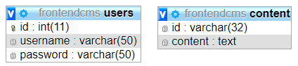
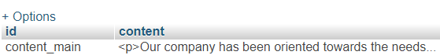
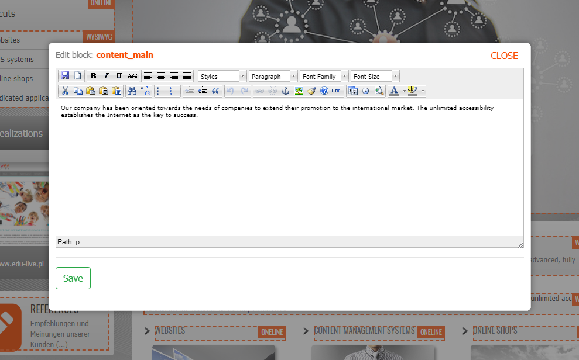
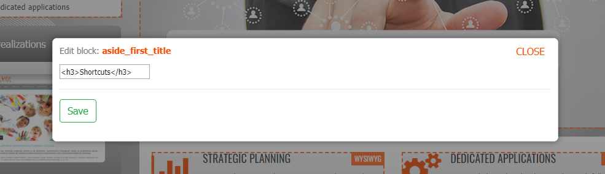

# Simple frontend CMS
#### Object PHP, MySQL, jQuery, Bootstrap, TinyMCE, MVC

Frontend CMS based on <a href="https://github.com/tomasz-dabrowski/frontend-sample">
frontend sample</a> project

### Youtube demo

<a href="https://www.youtube.com/watch?v=hgytjiOcmt4" title="Wath demo"></a>

### Online demo

- https://design.media.pl/github/frontend-cms/
- Username: admin 
- Password: demo

### MySQL

The database structure is very simple



### Howto use?

To create a block to edit with the name 'content-main' that you want to put anywhere on the page, just write:

```php
<?php $FrontendCMS->loginButton(); ?>
```
```php
<?php $FrontendCMS->toolbar(); ?>
```
```php
<?php $FrontendCMS->Cms->displayBlock('content-main', 'wysiwyg'); ?>
```
```php
<?php $FrontendCMS->Cms->displayBlock('aside-first-title', 'oneline'); ?>
```

A new record will be created in the database:



There are two content types of edit:

- Using TinyMCE editor - in the upper right corner of the orange frame with the text "WYWIWYG"



- Using one line - in the upper right corner of the orange frame with the text "ONELINE"

